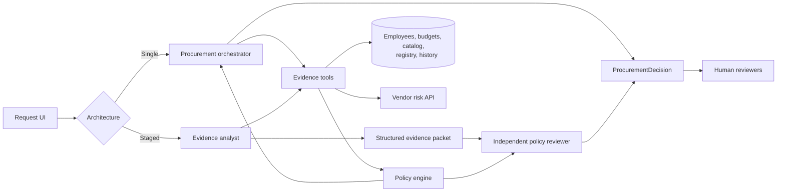

# Architecture and workflow

## Stakeholder need translated into requirements

Procurement needs faster evidence gathering without delegating approval authority to software. The product therefore joins internal and external evidence, encodes objective policy in code, exposes uncertainty, and hands a review-ready package to humans.

## Data flow

1. The request context tool resolves the request and employee department.
2. Budget, catalog, vendor registry, vendor risk API, and purchase history tools build a source-referenced `EvidencePacket`.
3. The policy tool checks completeness, thresholds, budget, overlap, sensitive data, vendor freshness/conflict, privacy, legal status, and prompt injection.
4. Recommendation logic selects the next safe workflow state: clarify, assess an existing option, hold for evidence verification, seek a budget exception, or proceed to named reviewers.
5. A validated `ProcurementDecision` is rendered in the UI. All outcomes remain advisory.

## Architecture responsibilities

### A. Single agent baseline

One orchestrator calls all evidence tools, invokes the policy engine once, and prepares the handoff. It has fewer moving parts and one deterministic policy call.

### B. Staged reviewer

The analyst gathers evidence and runs the first policy pass. A copied, structured evidence packet is passed to a reviewer that independently reruns policy. If the stages disagree, the design can add `agent_review_disagreement` and escalate. The copied handoff prevents reviewer mutations from changing the analyst's record.

## Deterministic and model-driven boundaries

Budget arithmetic, thresholds, date expiry, approvals, sensitive-data controls, missing data, conflicts, and injection detection are deterministic. This submission had no model credential, so evaluated runs truthfully report zero LLM calls and use the deterministic fallback. A production model may summarize ambiguous business needs or draft plain-language rationale, but its text must be treated as untrusted and cannot alter the policy result.

## Stop and escalation conditions

| Condition | Behavior |
|---|---|
| Material request data missing | Stop and ask for clarification |
| Cost exceeds available budget | Pause and route to Finance plus required reviewers |
| Risk API unavailable | Record failure; hold for Security verification |
| Vendor sources conflict or assessment is stale | Surface evidence; route to Security/manual review |
| Sensitive or cross-region use | Add Security, Privacy, or Legal as policy requires |
| Existing capability found | Ask requester and Procurement to document the gap |
| Injection-like business text | Ignore instruction, flag it, continue with real policy |

## Assumptions

- `2026-09-30` is the only date used for snapshot policy decisions.
- USD amounts are valid annualized estimates when present.
- Empty integration lists mean no integration declared; `unknown` data access is incomplete.
- Pending and not-completed vendor states both mean onboarding is incomplete.
- Category, vendor, or product matches are candidate overlaps rather than automatic rejections.

## Intentional scope limits

The MVP does not persist decisions, modify source systems, execute approvals, purchase software, authenticate users, or contact reviewers. Those capabilities would require identity, authorization, audit retention, idempotency, connector contracts, and stakeholder acceptance testing.

## Scaling path

Replace CSV readers with versioned connector interfaces; cache low-volatility catalog data; add timeouts, retry budgets, and circuit breakers; persist immutable decision/audit records; use role-based access; add asynchronous review queues; and monitor approval turnaround, clarification rate, override rate, false escalation rate, and evidence freshness. Promote a model-backed interpretation step only after offline evals and human review show measurable benefit.
